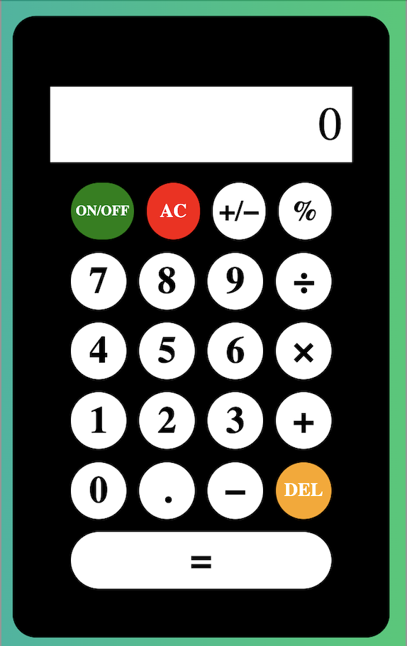

# 🔢 #100Devs Push Project001: Calculator

### Goal: Build a Simple Calculator using JS OOP best practices. Wanted to add a few extra functions beyond the basic arithmetic functions.

### What my version looks like

### How It's Made:
Tech used: HTML, CSS, Javascript

### Status:
I have a few extra features I want to add but the basic functionality works
